# 33) Federated Values — MVP {#adr_0033}

Date: 2025-07-15
Status: Draft

## Context

As part of the broader Wikibase federation effort, this ADR defines the first minimum-viable feature that allows users to select and display Items from remote Wikibase repositories (initially Wikidata only) as statement values.

When editing a statement, users can search for Items. Remote results from Wikidata appear in the autocomplete dropdown alongside local results. Users can select a remote Item, save the statement, and the remote value is persisted locally.

When displayed, remote values are visually indicated as originating from a remote Wikibase instance. The value renders as a link that, when clicked, opens the source entity page in a new window based on the source's concept URI.

## Decision

The Federated Values MVP consists of four key components, ordered here by the user flow:

```mermaid
flowchart LR
    subgraph Config["Entity Source Configuration"]
        ApiEntitySource["ApiEntitySource"]
        DefaultWikidata["DefaultWikidataEntitySourceAdder"]
    end

    subgraph Search["Remote Entity Search"]
        SearchClient["RemoteEntitySearchClient"]
        SearchHelper["RemoteEntitySearchHelper"]
        EntitySelector["entityselector.js"]
    end

    subgraph Storage["Remote Entity Storage"]
        RemoteEntityId["RemoteEntityId"]
        RemoteEntityStore["RemoteEntityStore"]
        StorageHook["RemoteEntityStorageHookHandler"]
    end

    subgraph Display["Remote Entity Lookup & Formatting"]
        RemoteEntityLookup["RemoteEntityLookup"]
        RemoteEntityFormatter["RemoteEntityIdValueFormatter"]
    end

    Config --> Search
    Search --> Storage
    Storage --> Display
```



### Entity Source Configuration

This component reuses and extends the configuration pattern established by Federated Properties. The existing `entitySources` configuration already defines remote sources with a `conceptBaseUri`. We extend `ApiEntitySource` with a `repoApiUrl` property, and add a helper function that derives the remote API endpoint from the concept URI when not explicitly configured.

`DefaultWikidataEntitySourceAdder` automatically injects Wikidata as a remote entity source when the feature flag is enabled:

```php
$wgWBRepoSettings['federatedValuesEnabled'] = true;
```

Key classes:
- `ApiEntitySource` — extended with optional `repoApiUrl` property
- `EntitySourceDefinitions` — new `getApiSources()` helper method
- `DefaultWikidataEntitySourceAdder` — configures Wikidata as default remote source, re-using a pattern from Federated Properties

### Remote Entity Search

When a user edits a statement, they can search for and select remote entities. Local results appear first, followed by remote results (currently only from Wikidata). Remote results are identified by their concept URI (e.g. `https://www.wikidata.org/entity/Q42`).

Key classes:
- `RemoteEntitySearchClient` — queries remote `wbsearchentities` API
- `RemoteEntitySearchHelper` — decorator merging remote results with local search
- `RemoteEntitySearchHelperCallbacksHookHandler` — hooks into entity search pipeline
- JavaScript entity selector override for displaying remote results in autocomplete

### Remote Entity Storage

When a user saves a page containing a remote entity reference, the entity data is fetched and stored locally. The `RemoteEntityId` value object (e.g. `https://www.wikidata.org/entity/Q42`) is persisted in the statement, while the entity's JSON data is cached in the `wb_remote_entity` table.

Key classes:
- `RemoteEntityId` — value object representing a remote entity
- `RemoteEntityStore` — database-backed storage in `wb_remote_entity` table
- `RemoteEntityIdParser` — parses remote entity ID strings
- `RemoteEntityStorageHookHandler` — defers storage until page save via `PageSaveComplete` hook

No automatic background synchronization or cache invalidation is performed in this MVP. The stored snapshot is used for all future reads until an explicit refresh occurs.

### Remote Entity Lookup & Formatting

When displaying a page, remote entities are rendered as HTML links pointing to their source repository. Each link includes a badge showing the source (e.g. "www.wikidata.org") and opens in a new tab.

Key classes:
- `RemoteEntityLookup` — retrieves entity data from local cache, fetches via `wbgetentities` API if missing
- `RemoteEntityIdValueFormatter` — renders remote entities as HTML links with source badges

### Remote Entity Sync

Scope TBD. This component will address keeping cached remote Items synchronized with their source. Options under consideration:

- Periodic maintenance scripts via MediaWiki job queue
- On-demand "refresh" action in the UI
- Visual staleness indicators (e.g. color-coded freshness based on configurable thresholds)

Note: The storage layer includes an optional `remoteEntityCacheTTL` Repo setting (`$wgWBRepoSettings['remoteEntityCacheTTL']`) that, when configured, treats cached entities as expired after the specified number of seconds. By default this is not set, meaning cached data never expires automatically. This mechanism is implemented but not advertised until the broader sync strategy is decided.

### Remote Entity Handling in Client

Scope TBD. When accessing a Wikibase repository as a Client (e.g. Wikipedia consuming Wikidata), Remote Items referenced in statements need appropriate handling and display. This may require changes to how Client renders entity values or follows links to remote sources.

## Consequences

- Enables merged search and selection of remote Items within statement editors
- Introduces the concept of a stable, locally cached "remote value"
- Adds no background synchronization load to Wikidata
- Provides a layered, testable architecture with clear separation of concerns
- Each layer can be reviewed and deployed independently via Gerrit changeset chain

## Note on Federated Properties

This feature does not strictly require removal of the existing Federated Properties code. However, it is expected that by the time Federated Values is released, the Federated Properties implementation will likely be removed.

The Remote Entity storage and lookup system implemented here retraces a significant portion of the Federated Properties feature set while using more up-to-date implementation patterns aligned with current Wikibase best practices. This creates a strong common foundation for extending federation features in the future.

Removal of Federated Properties has been discussed across the Wikibase teams with general consensus to proceed. The introduction of this Remote Entity layer further justifies that decision by providing a cleaner, more maintainable approach to federation that can support both federated values (Items as statement values) and, in the future, federated properties if needed.
